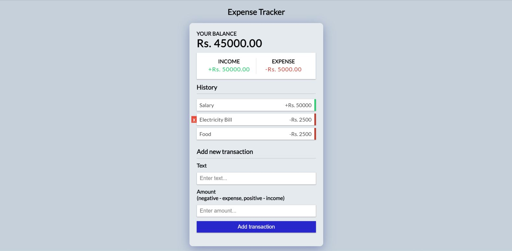

# Expense Tracker

## About Expense Tracker app

- The app provides basic features for tracking your expenses such as adding your income, expenditures and deleting tracked items when you no longer need it.
- Uses modern react with functional components, hooks and Context API. Uses useReducer in combination with Context API. Created for getting a better understanding of Context API, localStorage and hooks.
